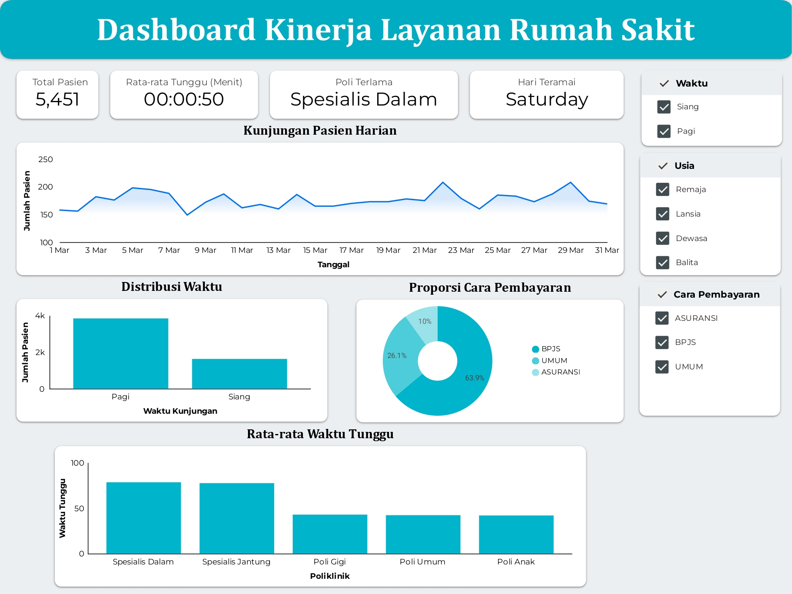
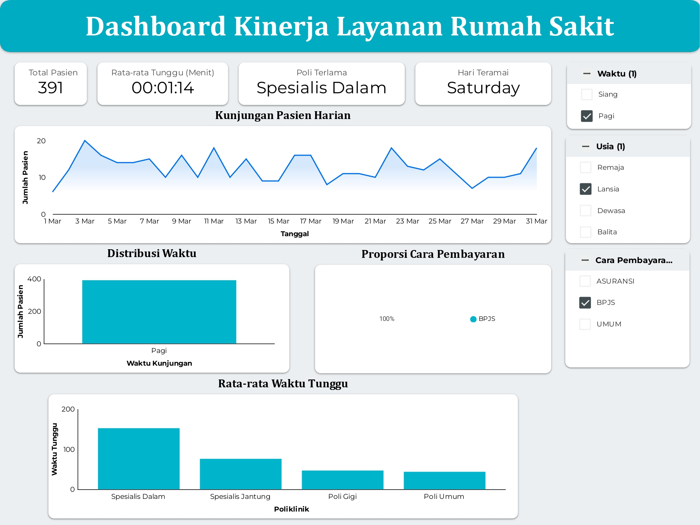

# Hospital Waiting Time Dashboard Analysis

## Deskripsi Proyek

Kualitas layanan rumah sakit sangat dipengaruhi oleh efisiensi waktu tunggu pasien. Namun, peningkatan jumlah kunjungan dan ketidakseimbangan beban layanan antar poliklinik sering menyebabkan antrean yang panjang serta menurunkan kepuasan pasien.

Proyek ini bertujuan untuk menganalisis pola kunjungan pasien dan mengidentifikasi faktor-faktor yang menyebabkan tingginya waktu tunggu menggunakan dashboard interaktif di Google Looker Studio. Hasil analisis diharapkan dapat membantu manajemen rumah sakit dalam mengambil keputusan berbasis data untuk meningkatkan efisiensi operasional layanan.

---

## Tujuan Analisis

* Menganalisis tren kunjungan pasien.
* Mengidentifikasi poliklinik dengan waktu tunggu tertinggi.
* Menganalisis distribusi pasien berdasarkan metode pembayaran.
* Menginvestigasi faktor-faktor yang menyebabkan lonjakan waktu tunggu.
* Memberikan rekomendasi untuk meningkatkan kualitas layanan rumah sakit.

---

## Dataset

Dataset operasional rumah sakit yang digunakan mencakup beberapa variabel utama:

| Variabel          | Deskripsi                |
| ----------------- | ------------------------ |
| waktu_registrasi  | Waktu pendaftaran pasien |
| kd_poli           | Poliklinik tujuan pasien |
| durasi_tunggu_mnt | Lama waktu tunggu pasien |
| kategori_usia     | Kelompok usia pasien     |
| metode_bayar      | Jenis pembayaran pasien  |
| no_rm             | Nomor rekam medis pasien |

---

## Tools yang Digunakan

* Python
* Pandas
* Google Colab
* Google Looker Studio

---

## Data Preparation

### Data Cleaning

Tahapan pembersihan data meliputi:

* Pemeriksaan missing value
* Penghapusan data yang tidak lengkap
* Perbaikan format data
* Standarisasi kategori

### Transformasi Data

Dilakukan beberapa transformasi untuk mendukung analisis:

* Pemisahan kolom waktu registrasi menjadi:

  * Tanggal
  * Hari
  * Jam
* Standarisasi nama poliklinik
* Standarisasi metode pembayaran
* Pembuatan field tanggal menggunakan fungsi PARSE_DATE() pada Looker Studio

---

## Dashboard Overview

Dashboard terdiri dari dua halaman utama:

### Dashboard Utama

Menampilkan:

* Total kunjungan pasien
* Hari dengan kunjungan tertinggi
* Distribusi metode pembayaran
* Rata-rata waktu tunggu per poliklinik
* Tren kunjungan harian

### Dashboard Investigasi

Digunakan untuk melakukan analisis lebih lanjut terhadap kelompok pasien tertentu melalui filter interaktif.

---

## Insight & Analisis

### 1. Tren Kunjungan Pasien

Jumlah kunjungan pasien menunjukkan pola fluktuatif sepanjang bulan Maret dengan kisaran sekitar 150–210 pasien per hari.

Hari dengan jumlah kunjungan tertinggi adalah **Sabtu**, yang menunjukkan peningkatan aktivitas layanan pada akhir pekan.

**Insight:**
Rumah sakit perlu memastikan kesiapan sumber daya pada hari dengan tingkat kunjungan tinggi untuk menghindari penumpukan antrean.

---

### 2. Distribusi Metode Pembayaran

Komposisi pasien berdasarkan metode pembayaran:

* BPJS : 63,9%
* Umum : 26,1%
* Asuransi : 10%

**Insight:**
Mayoritas pasien menggunakan BPJS sehingga proses administrasi BPJS memiliki pengaruh besar terhadap kinerja layanan secara keseluruhan.

---

### 3. Evaluasi Waktu Tunggu per Poliklinik

Poliklinik dengan rata-rata waktu tunggu tertinggi:

| Poliklinik        | Rata-rata Waktu Tunggu |
| ----------------- | ---------------------- |
| Spesialis Dalam   | ±80 menit              |
| Spesialis Jantung | ±75 menit              |

Sedangkan Poli Gigi, Poli Anak, dan Poli Umum memiliki waktu tunggu yang relatif lebih rendah.

**Insight:**
Terdapat ketimpangan beban layanan antar poliklinik yang perlu dievaluasi lebih lanjut.

---

### 4. Investigasi Kasus Waktu Tunggu Tinggi

Analisis dilakukan terhadap kelompok:

* Usia: Lansia
* Metode Pembayaran: BPJS
* Waktu Kunjungan: Pagi Hari

Hasil menunjukkan:

* Total pasien: 391 pasien
* Rata-rata waktu tunggu: ±74 menit
* Poli Spesialis Dalam mencapai waktu tunggu hingga ±150 menit

**Insight:**
Pasien lansia pengguna BPJS pada pagi hari mengalami waktu tunggu paling tinggi dibanding kelompok lainnya.

---

## Rekomendasi

Berdasarkan hasil analisis, beberapa rekomendasi yang dapat dilakukan adalah:

### Optimalisasi SDM

Menambah tenaga medis atau jadwal praktik pada Poli Spesialis Dalam, terutama pada jam sibuk.

### Sistem Prioritas Lansia

Menerapkan jalur atau antrean khusus bagi pasien lansia untuk mengurangi waktu tunggu.

### Optimalisasi Administrasi BPJS

Mempercepat proses administrasi guna mengurangi bottleneck pada tahap registrasi.

### Distribusi Beban Layanan

Mengatur distribusi pasien antar poliklinik apabila memungkinkan untuk mengurangi kepadatan layanan.

---

## Kesimpulan

Analisis menunjukkan bahwa waktu tunggu pasien dipengaruhi oleh tingginya volume kunjungan, dominasi pasien BPJS, serta ketidakseimbangan beban layanan antar poliklinik.

Poli Spesialis Dalam menjadi area prioritas karena memiliki rata-rata waktu tunggu tertinggi. Selain itu, pasien lansia pengguna BPJS pada pagi hari mengalami kondisi antrean yang paling kritis.

Dashboard interaktif yang dibangun membantu manajemen rumah sakit dalam memahami kondisi operasional secara lebih cepat dan mendukung pengambilan keputusan berbasis data.

---

## Dashboard Preview

### Dashboard Utama

### Dashboard Investigasi

---

## Live Dashboard

[View Interactive Dashboard](https://datastudio.google.com/s/mbGSs6xCxLc)

---

## Skill yang Ditunjukkan

* Data Cleaning
* Data Transformation
* Exploratory Data Analysis (EDA)
* Dashboard Development
* Google Looker Studio
* Operational Analytics
* Healthcare Analytics
* Data Storytelling
* Business Insight Generation

---

## Author

Shofia Nabila

Studi Independen Data Analyst | Vinix7

Sistem Informasi Kelautan | Universitas Pendidikan Indonesia

